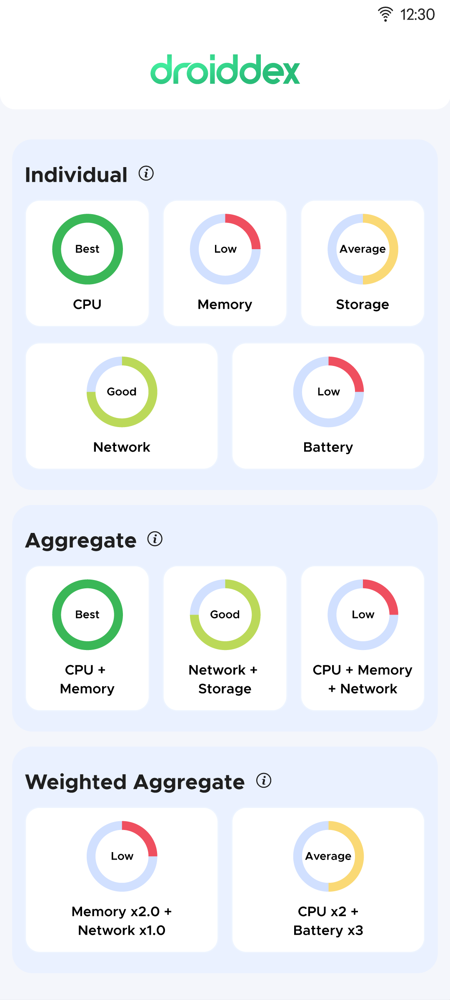

<!--suppress HtmlDeprecatedAttribute -->
<div align="center">


</div>

## Introduction

Droid Dex is a powerful tool crafted to enhance the performance of your Android applications, ultimately elevating the
user experience. With a focus on addressing key performance issues, it is your solution for addressing prevalent
challenges like Jerky(Janky) Scrolling, Out of Memory errors (OOMs), High Battery Consumption, and instances of
Application Not Responding (ANR).

It classifies and lets you analyze Android Device Performance across various parameters like:

| PARAMETER                                                                                                                  | DESCRIPTION                                         |
|----------------------------------------------------------------------------------------------------------------------------|-----------------------------------------------------|
| <div align="center">[CPU](./droid-dex/src/main/kotlin/com/blinkit/droiddex/cpu/CpuPerformanceManager.kt)</div>             | Total RAM, Core Count, CPU Frequency                |
| <div align="center">[MEMORY](./droid-dex/src/main/kotlin/com/blinkit/droiddex/memory/MemoryPerformanceManager.kt)</div>    | Heap Limit, Heap Remaining, Available RAM           |
| <div align="center">[NETWORK](./droid-dex/src/main/kotlin/com/blinkit/droiddex/network/NetworkPerformanceManager.kt)</div> | Bandwidth Strength, Download Speed, Signal Strength |
| <div align="center">[STORAGE](./droid-dex/src/main/kotlin/com/blinkit/droiddex/storage/StoragePerformanceManager.kt)</div> | Available Storage                                   |
| <div align="center">[BATTERY](./droid-dex/src/main/kotlin/com/blinkit/droiddex/battery/BatteryPerformanceManager.kt)</div> | Percentage Remaining, If Phone is Charging or Not   |

into various [levels](./droid-dex/src/main/kotlin/com/blinkit/droiddex/constants/PerformanceLevel.kt): EXCELLENT, HIGH,
AVERAGE, LOW

It is a compact library accompanied by extensive in-line documentation, providing users with the opportunity to delve
into the code, comprehend each line thoroughly, and, ideally, contribute to its development.

## Use Cases

1. Consider a scenario where background polling of an API is necessary. In this context, the `BATTERY` level becomes a
   crucial factor, as frequent polling can significantly drain the device's battery. To address this concern, you can
   optimize the process using the following code snippet:

   ```Kotlin
   DroidDex.getPerformanceLevelLd(PerformanceClass.BATTERY).observe(this) {
      // Adjust the polling time interval
   }
   ```

2. Consider a scenario where you need to tailor the image quality for users based on their devices. In this context, the
   `NETWORK` condition plays a crucial role in decision-making, as achieving better image quality typically involves
   larger file sizes and increased data transfer. However, `MEMORY` is also a consideration, as higher-quality images
   generate heavier bitmaps, consuming more memory. To optimize this process, you can use the following code snippet:

   ```Kotlin
   DroidDex.getWeightedPerformanceLevelLd(PerformanceClass.NETWORK to 2F, PerformanceClass.MEMORY to 1F).observe(this) {
      // Implement image quality optimization
   }
   ```

## Usage

Initialize the library in your Application class using the following code snippet:

```Kotlin
DroidDex.init(this) // Parameter: Application Context
```

1. To get performance level for single/multiple parameters:

    ```Kotlin
    DroidDex.getPerformanceLevel(params)
    ```

   For observing the changes:

    ```Kotlin
    DroidDex.getPerformanceLevelLd(params).observe(this) {
    }
    ```

   Replace `params` with comma separated list of `Performance Class(es)`.

   Example:
   ```Kotlin
   DroidDex.getPerformanceLevel(PerformanceClass.CPU, PerformanceClass.MEMORY)
   ```

2. To get performance level for multiple parameters with unequal weights:

    ```Kotlin
    DroidDex.getWeightedPerformanceLevel(params)
    ```

   For observing the changes:

    ```Kotlin
    DroidDex.getWeightedPerformanceLevelLd(params).observe(this) {
    }
    ```

   Replace `params` with a comma separated list of `Performance Classes` to their `Weights`.

   Example:
   ```Kotlin
   DroidDex.getWeightedPerformanceLevelLd(PerformanceClass.CPU to 2F, PerformanceClass.MEMORY to 1F).observe(this) {
   }
   ```

<!--suppress HtmlDeprecatedAttribute -->
<div align="center">
	<!--suppress CheckImageSize -->
	
</div>

See [Example Project](example) for further usage

## Setup

<details open>
<summary>For versions 3.+</summary>

The latest release is available on [Maven Central](https://central.sonatype.com/artifact/com.eternal.kits/droid-dex).

```Kotlin
implementation("com.eternal.kits:droid-dex:<<latest_version>>")
```

</details>

<details>
<summary>For versions 2.x and before</summary>

Add this to your `settings.gradle[.kts]` file

```Kotlin
dependencyResolutionManagement {
	repositories {
		maven {
			url = uri("https://maven.pkg.github.com/grofers/*")
			credentials {
				username = "Blinkit"
				password = GITHUB_PERSONAL_ACCESS_TOKEN
			}
		}
	}
}
```

And add this dependency to your project level `build.gradle[.kts]` file:

```Kotlin
implementation("com.blinkit.kits:droid-dex:<<your_version>>")
```

</details>
